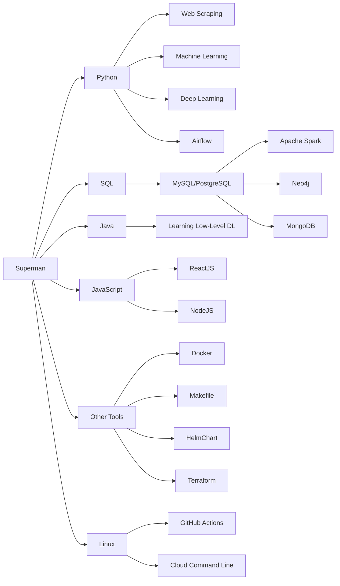

## Hi there 👋

  

  

### 👨‍💻 About Me /

- ⭐ Data engineer with a passion for advanced algorithms and AI systems
- 🌱 Currently studying for a Master's in Computer Science
- 💻 Competitive programmer on LeetCode, HackerRank

### 🛠️ Current Skills /

- **Languages**  

   
  
  
  
  

