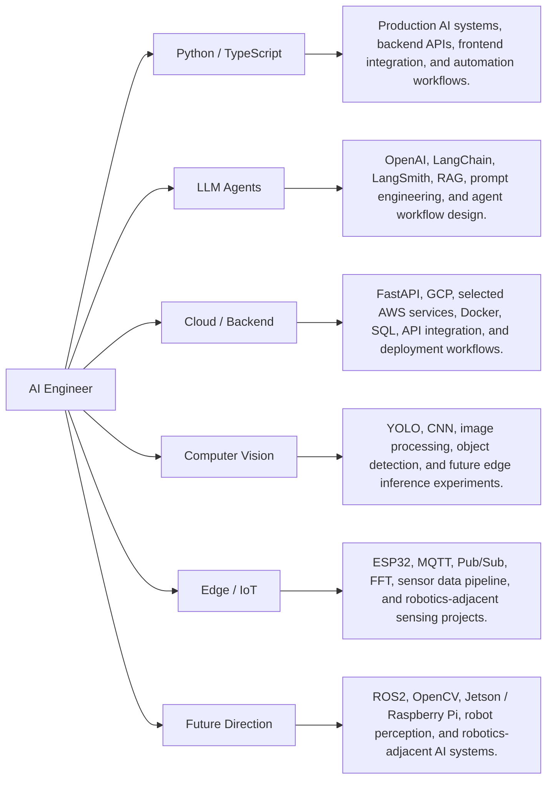

## Hi there 👋

  

  

### 👨‍💻 About Me /

- ⭐ AI engineer based in Hong Kong, building production automation systems with LLM agents, APIs, cloud, and telecom workflows
- 🌱 MSc Computer Science graduate from HKU, moving toward robotics-adjacent AI, computer vision, and edge AI systems
- 💻 Mainly working with Python and TypeScript in production (LangChain, FastAPI, GCP). Also building hands-on projects in YOLO, ESP32, and MQTT toward computer vision and edge AI.

### 🛠️ Current Skills /

- **Languages**  

   
  
  
  
  

```mermaid
graph LR;

    %% Central Role
    Z["AI Engineer"];
    
    %% Main Categories
    Z --> A["Python / TypeScript"];
    A --> AA["Production AI systems, backend APIs, frontend integration, and automation workflows."];
    
    Z --> B["LLM Agents"];
    B --> BB["OpenAI, LangChain, LangSmith, RAG, prompt engineering, and agent workflow design."];
    
    Z --> C["Cloud / Backend"];
    C --> CC["FastAPI, GCP, selected AWS services, Docker, SQL, API integration, and deployment workflows."];
    
    Z --> D["Computer Vision"];
    D --> DD["YOLO, CNN, image processing, object detection, and future edge inference experiments."];
    
    Z --> E["Edge / IoT"];
    E --> EE["ESP32, MQTT, Pub/Sub, FFT, sensor data pipeline, and robotics-adjacent sensing projects."];
    
    Z --> F["Future Direction"];
    F --> FF["ROS2, OpenCV, Jetson / Raspberry Pi, robot perception, and robotics-adjacent AI systems."];

```
